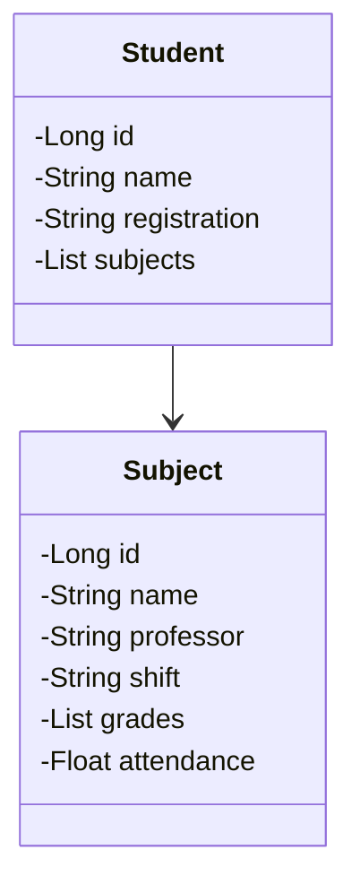

```mermaid
classDiagram
    class Student {
        -Long id
        -String name
        -String registration
        -List<Subject> subjects
    }

    class Subject {
        -Long id
        -String name
        -String professor
        -String shift
        -List<Float> grades
        -Float attendance
    }

    Student --> Subject
```