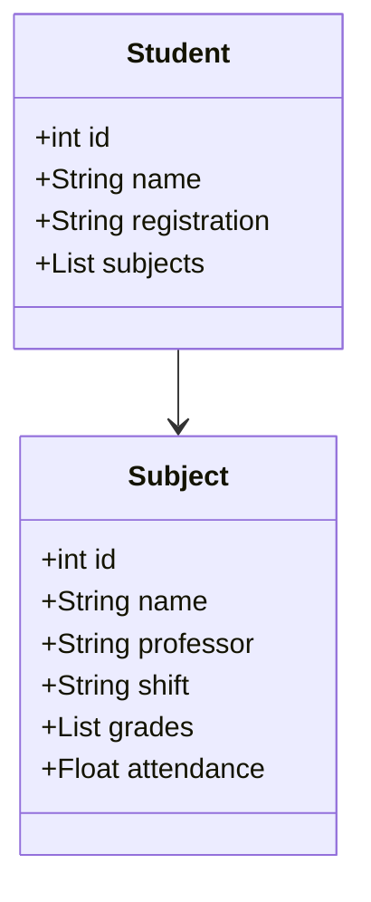

```mermaid
classDiagram
    class Student {
        +int id
        +String name
        +String registration
        +List<Subject> subjects
    }

    class Subject {
        +int id
        +String name
        +String professor
        +String shift
        +List<Float> grades
        +Float attendance
    }

    Student --> Subject
```