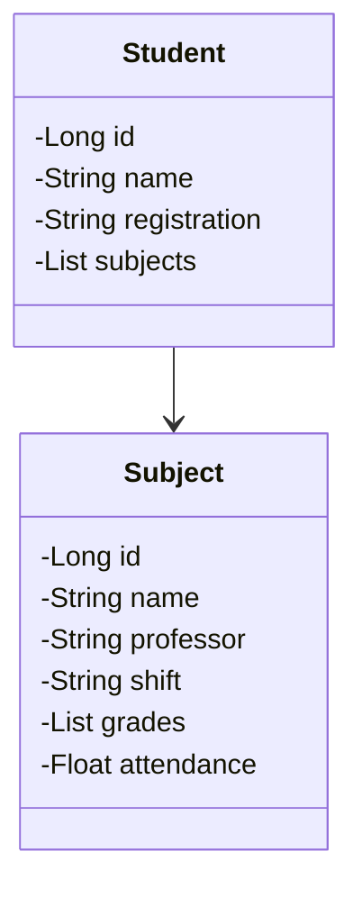

# ☁️ API REST na Nuvem Usando Spring Boot

Bem-vindo(a)! Este repositório contém o projeto **API REST na Nuvem Usando Spring Boot**, desenvolvido com o objetivo de praticar a criação e deploy de uma API moderna utilizando o framework Spring Boot e hospedagem na nuvem.

---

## 📝 Descrição Geral

Este projeto consiste em uma API RESTful desenvolvida com Spring Boot, que permite operações básicas de CRUD (Create, Read, Update, Delete). A API foi pensada para ser escalável, seguindo boas práticas de arquitetura, e está implantada em ambiente de produção na nuvem utilizando o Railway.

A ideia principal é aplicar os conhecimentos em backend com Java, explorar o uso de variáveis de ambiente, organização por perfis (dev/prod), versionamento com Git e deploy contínuo.

## 💻 Tecnologias Utilizadas

- ✅ Java 17  
- ✅ Spring Boot  
- ✅ Gradle  
- ✅ PostgreSQL (Railway)  
- ✅ Railway (Deploy na nuvem)

---

## 📚 Diagrama de Classes

